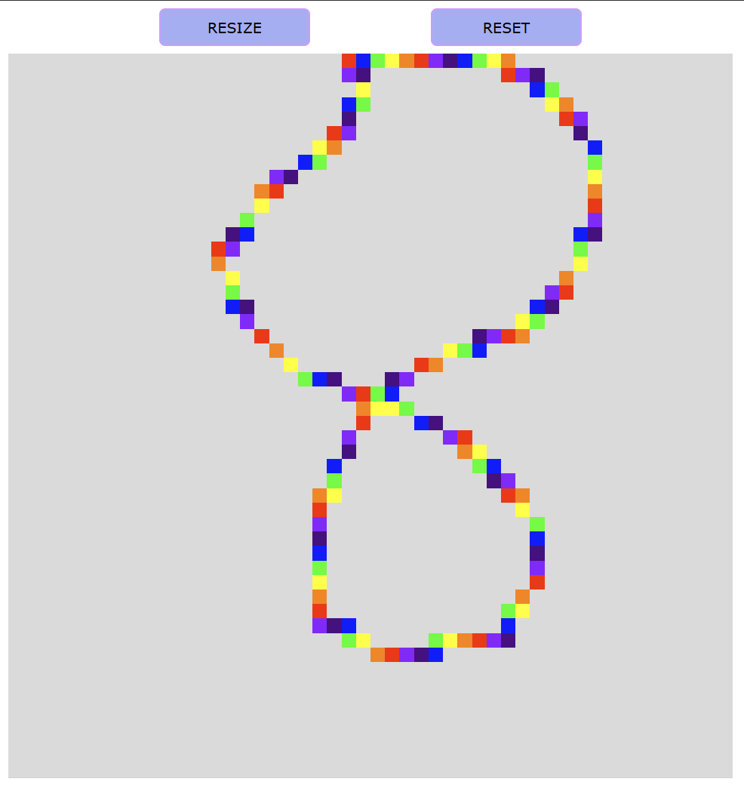

# Etch-A-Sketch

An interactive web-based sketchpad inspired by the classic Etch-A-Sketch toy, created as part of The Odin Project curriculum.

## Demo

[Live Demo](http://etch-a-sketch.octoprismo.com/)



## Features

- Dynamic grid creation using JavaScript
- Hover effect that leaves a pixelated trail through the grid
- Rainbow mode that randomly changes colors with each interaction
- Responsive design that maintains square proportions
- Interactive UI with a button to reset and resize the grid
- User input to determine the number of squares per side (up to 100)

## Built With

- HTML5
- CSS3 (Flexbox for grid layout)
- JavaScript (ES6+)

## How It Works

1. The webpage displays a square grid of divs created dynamically with JavaScript
2. As your mouse passes over each div, it changes to a random color, creating a colorful drawing effect
3. A button at the top allows you to reset the grid and specify a new size
4. The grid maintains its overall dimensions while changing the number of squares inside

## Implementation Details

- Grid elements are created entirely with JavaScript DOM manipulation
- Flexbox is used to create a perfect grid layout that maintains square proportions
- Event listeners handle mouse interactions to create the drawing effect
- Random color generation for rainbow drawing effect
- Two buttons for different functions: RESIZE prompts for a new grid size, RESET clears the current grid
- Input validation ensures the grid size stays within reasonable limits

## Challenges Overcome

- Creating a responsive grid that maintains square cells
- Implementing a hover effect that leaves a trail through the grid
- Managing event listeners for dynamically created elements
- Ensuring proper cleaning and recreation of the grid when resizing

## Future Enhancements

- Color picker for different drawing colors
- Option to toggle between solid color and rainbow mode
- Eraser functionality
- Save or download your drawings
- Touch support for mobile devices

## Getting Started

### Prerequisites

- A modern web browser (Chrome, Firefox, Safari, Edge)

### Installation

1. Clone the repository:
   ```
   git clone https://github.com/octoprismo/etch-a-sketch.git
   ```

2. Open `index.html` in your web browser.

3. Start sketching by hovering over the grid!

## Development Process

This project was developed by following these steps:

1. Setting up the HTML structure with a container for the grid
2. Writing JavaScript to dynamically create the grid divs
3. Implementing the hover effect using event listeners
4. Adding the reset/resize functionality
5. Styling the interface to look appealing and responsive

## Acknowledgments

- [The Odin Project](https://www.theodinproject.com) for the project idea and guidance
- Original Etch-A-Sketch toy for the inspiration

## License

This project is licensed under the MIT License - see the [LICENSE.md](LICENSE.md) file for details.
